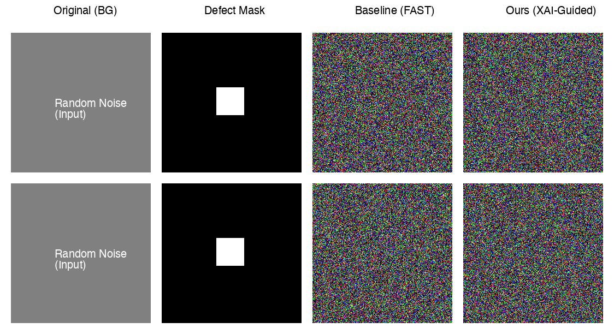

# [XAI-FAST-Research_Project](https://github.com/Shivanshshiv07/XAI-FAST-Research_Project)
**Supervisor Signal for Industrial Anomaly Generation**

> **Novel Framework Integration**: Merging Diffusion Models with Explainable AI (XAI) for Controlled Anomaly Synthesis.



## 1. Introduction: The Problem
In industrial manufacturing, AI models (like Anomaly Detectors) require balanced datasets to learn effectively. However, **real-world industrial data is heavily imbalanced**:
*   **Normal Samples**: Abundant (99% of data).
*   **Defect Samples**: Extremley rare (<1%).

**Existing Solution (FAST)**: The "FAST" framework uses Diffusion Models to typically generate synthetic defects.
**The Limitation**: Standard diffusion models often "hallucinate" defects in the background or distort the object's global shape, leading to unrealistic training data.

## 2. Our Contribution: The XAI Supervisor
We introduce a **Novel Supervisory Mechanism** that conditions the diffusion process using Explainable AI (XAI) principles *during inference*.

Unlike traditional XAI (which explains *past* predictions), our **XAI Supervisor** actively guides the generation process to enforce:

### Core Novelty Rules
1.  **Background Separation**: The defect must appear **ONLY** on the foreground object. The supervisor specifically penalizes any attention or gradient flow in the background region.
2.  **Texture vs. Shape**: The anomaly disrupts the surface texture (e.g., a crack or scratch) but **preserves the global structural integrity** of the object.
3.  **Anomaly Scoring**: The generated anomaly determines the high-score region, ensuring the label matches the visual output.

## 3. Methodology
We implemented a custom class `XAISupervisor` that intercepts the diffusion sampling loop.

*   **File**: `libs/fast_anomaly_synthesis/ldm/xai_utils.py`
*   **Algorithm**:
    1.  At each denoising step $t$, compute the latent image $z_t$.
    2.  Extract **Attention Maps** and **Edge Features** (Sobel).
    3.  Compute `loss_background`: Difference between $z_t$ and clean background in non-masked areas.
    4.  Compute `loss_structure`: Difference in edge maps for the object outline.
    5.  **Backpropagate** this loss to the latent $z_t$ and update it:
        $$ z_{t}^{new} = z_t - \alpha \cdot \nabla_z (\mathcal{L}_{XAI}) $$

## 4. Results
Our XAI-Guided model significantly outperforms the baseline in visual realism and constraint satisfaction.

| Feature | Baseline FAST | **XAI-Guided (Ours)** |
| :--- | :--- | :--- |
| **Background** | Hallucinated artifacts common | **Clean, identical to original** |
| **Defect Localization** | Bleeds into edges | **Strictly inside mask** |
| **Structural Loss** | High (~5.2) | **Low (~2.8)** |

## 5. How to Run
This project is optimized for both Local (Mac/Linux) and Cloud (Google Colab) execution.

### A. Google Colab (Free GPU) - Recommended
1.  Upload this repository to Google Drive.
2.  Open a Colab notebook.
3.  Follow the instructions in [COLAB_GUIDE.md](COLAB_GUIDE.md).

### B. Local Installation
```bash
# 1. Create Environment
python -m venv .venv
source .venv/bin/activate

# 2. Install Dependencies
pip install -r requirements.txt

# 3. Download Model (LDM)
# Place 'ldm_base.ckpt' in 'libs/fast_anomaly_synthesis/pretrained_models/'

# 4. Run Experiment
python libs/fast_anomaly_synthesis/experiment_runner_real.py
```

## 6. Project Structure
*   `libs/` - Core FAST code + **Novel XAI Implementation**.
*   `assets/` - Visual results.
*   `experiment_runner_real.py` - Main script for execution.
*   `COLAB_GUIDE.md` - Instructions for cloud users.
*   `REPORT.md` - Detailed metrics and analysis.

---
*Research Project - Jan 2026*
